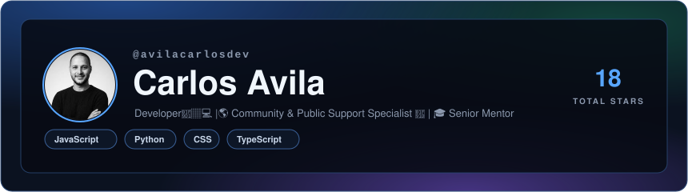
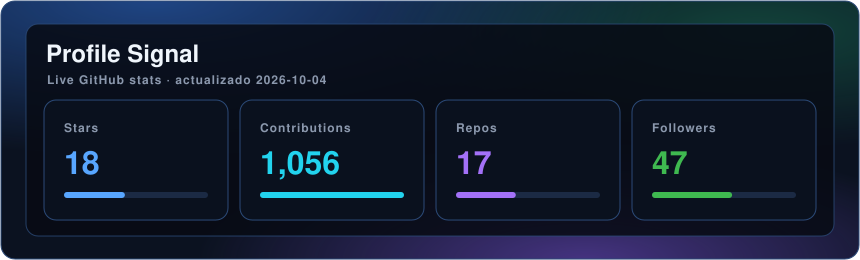
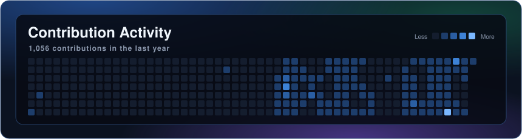

<!-- Tarjetas generadas por scripts/generate.mjs (GitHub Action diaria). No editar los SVG a mano. -->

<a href="https://github.com/AvilaCarlosDev/repo-maintenance-bot">repo-maintenance-bot</a> ·
<a href="https://github.com/AvilaCarlosDev/mcp-readiness-check">mcp-readiness-check</a> ·
<a href="https://github.com/AvilaCarlosDev/apis-gratis-es">apis-gratis-es</a> ·
<a href="https://github.com/AvilaCarlosDev/awesome-venezuela-dev">awesome-venezuela-dev</a>

