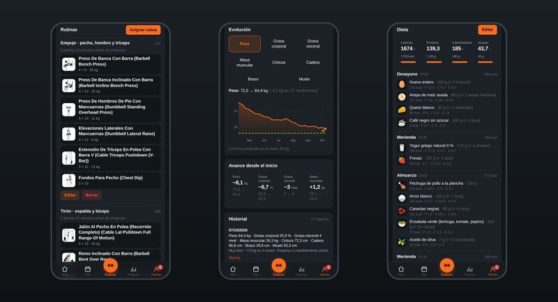
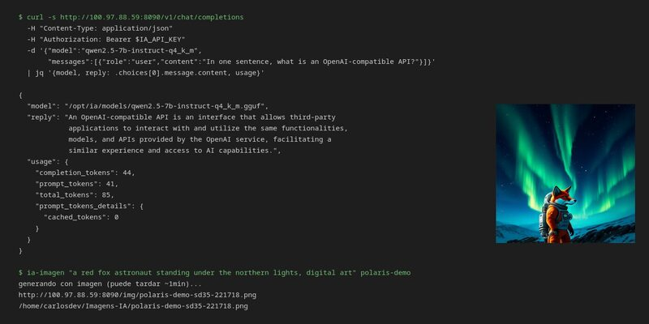
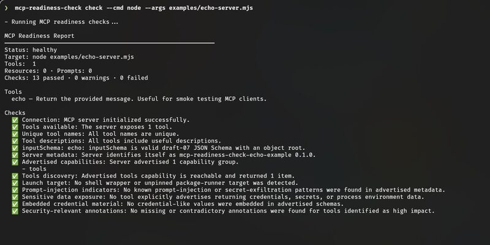
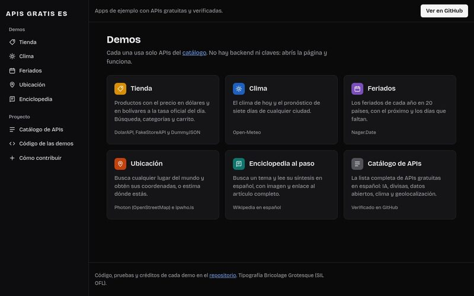
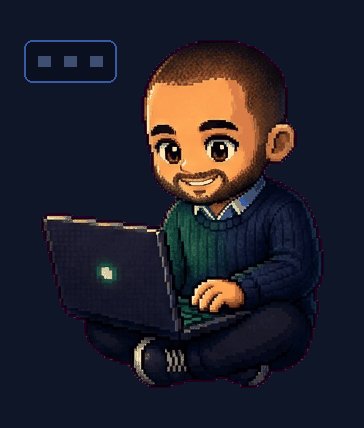

<!-- Carlos Avila · GitHub profile README -->

# Hi, I'm Carlos 👋

**Full-stack developer from Venezuela 🇻🇪. I build web apps that are in production, developer tools with tests, and websites for small businesses.**

React, Node.js, Python and Supabase/PostgreSQL. Senior Mentor at [4Geeks Academy](https://4geeksacademy.com), where I review projects and help people debug every day. Every number in my READMEs is measured in the repository, not estimated. *Hablo español: también trabajo con clientes en español.*

[**Portfolio**](https://avilacarlosdev.com) · [**LinkedIn**](https://www.linkedin.com/in/avilacarlosdev) · [**Email**](mailto:contacto@avilacarlosdev.com) · [**CV (PDF)**](https://avilacarlosdev.com/Carlos-Avila-CV-EN.pdf)

---

## What I build

| 📱 Web apps in production | 🛠️ Developer tools | 🏪 Websites for businesses |
|---|---|---|
| Full apps with accounts, roles and row-level security: React + Supabase, installable as a PWA. | CLIs and local AI tooling in TypeScript and Python, with CI and real test coverage. | Fast landing pages that take orders and bookings over WhatsApp, published on Vercel. |

## Featured projects

<table>
<tr>
<td width="50%" valign="top">

<h3><a href="https://github.com/AvilaCarlosDev/Forja">Forja</a> · <a href="https://forja-trainer.vercel.app">live app</a></h3>
App for personal trainers and their clients: assigned routines, diet, measurements, progress charts and payments. <b>In production.</b> 
React · Supabase · PostgreSQL RLS · PWA — 160 tests, 109 permission tests, 13 migrations
</td>
<td width="50%" valign="top">

<h3><a href="https://github.com/AvilaCarlosDev/polaris-local-ai">polaris-local-ai</a></h3>
Local AI stack for an 8 GB AMD RX 580: an OpenAI-compatible router serving text, vision and image models on Vulkan, no cloud. 
Python · Vulkan · llama.cpp — 6 text/vision models, 2 image models, 25 tests
</td>
</tr>
<tr>
<td width="50%" valign="top">

<h3><a href="https://github.com/AvilaCarlosDev/mcp-readiness-check">mcp-readiness-check</a></h3>
CLI that connects to an MCP server, inspects the tools it exposes, validates their schemas and writes console, JSON and Markdown reports. 
TypeScript · Node.js — 94 tests, 94% coverage
</td>
<td width="50%" valign="top">

<h3><a href="https://github.com/AvilaCarlosDev/apis-gratis-es">apis-gratis-es</a> · <a href="https://avilacarlosdev.github.io/apis-gratis-es/">live demos</a></h3>
Verified catalog of free public APIs for Spanish-speaking developers, with demos that work live. 
Python · JavaScript — 23 verified APIs, 5 demos, 351 tests
</td>
</tr>
</table>

**Websites for businesses:** delivery, barbershop, sports store, hardware store, florist and taxi — six published demos that take orders over WhatsApp. [See them on my portfolio →](https://avilacarlosdev.com/#negocios)

## Stack

`JavaScript` `TypeScript` `React` `Node.js` `Python` `PostgreSQL` `Supabase` `Astro` `Vite` `Docker` `Linux` `Git` `MCP`

## Let's work together

Open to **freelance projects** and **remote full-stack roles**. Write to [contacto@avilacarlosdev.com](mailto:contacto@avilacarlosdev.com) or through the [contact form on my portfolio](https://avilacarlosdev.com/#contacto).

